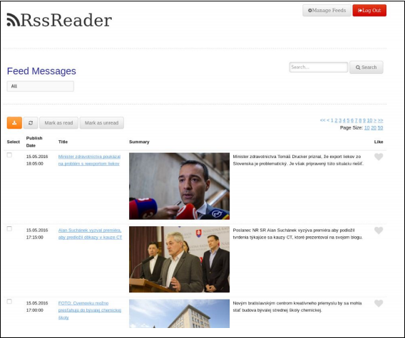

# rssreader

RSS feed aggregator application



## Features:
- User Management
  - Login, Registration, Manage users
  
- Each user manages his own list of Atom/RSS feeds
  - Adding, Deletion, Custom names
  
- Display a list of articles from the user's feeds
  - Click to redirect to the original article
  - Filtering - by channel, search in names
  - Paging
  - Mark as read
  - Like flag

  
## Technologies:
- Java 1.8
- Apache Wicket Framework
- Spring Framework
- Hibernate
- MySQL
- Maven

## Instructions:

To initialize the database execute the schema.sql file.

Modify the database properties in:
```
/src/main/webapp/WEB­INF/jdbc.properties
```

To run using maven (for development):
```
mvn jetty:run
```

To compile
```
mvn clean install
```
